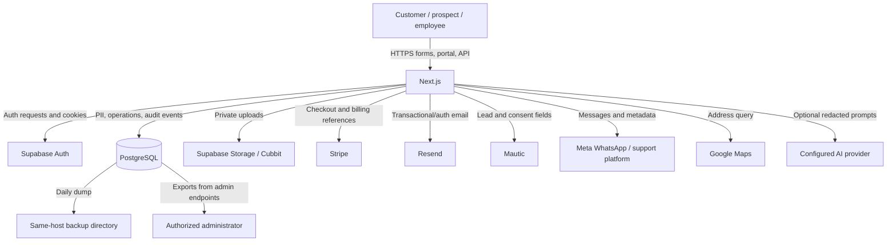

# Data-flow inventory

Status: **DRAFT — REQUIRES OPERATIONAL AND LEGAL REVIEW**

## End-to-end view

## Inventory

| Category | Classification | Collected | Transmitted/processed | Stored | Backed up | Logged/exported | Deletion/retention | Evidence and gap |
| --- | --- | --- | --- | --- | --- | --- | --- | --- |
| Customer identity/contact | Confidential | Signup, assessment, profile, support, early-access forms | App, Supabase, Resend; Mautic/WhatsApp/support where used | `customers`, leads, auth identity and related tables | Included in PostgreSQL dump if deployed as coded | Admin/customer views; selected audit events; subscriber CSV export | Partial retention jobs; complete schedule not defined | Migrations/routes; processor purposes and deletion propagation require verification |
| Addresses/property information | Restricted | Assessment/property forms and Google autocomplete | App, Supabase, Google Maps queries | `properties`, `cleaning_properties`, assessments, access preferences | PostgreSQL dump | Portal/admin views and operational records | No complete property/access retention rule found | Access notes may create physical-security risk; minimize and segregate |
| Appointments and service operations | Confidential | Assessment and maintenance booking flows; staff updates | App, database, email/WhatsApp notifications | assessments, service bookings/visits, AC appointments | PostgreSQL dump | Audit/activity events and operational dashboards | No approved retention schedule found | Time/location data may reveal customer presence and staff movements |
| Employee information | Restricted | Staff administration and operational use | App and database; possibly support/email | `staff_members`, attendance, sick leave, live status, KPI records | PostgreSQL dump | Manager/admin views; audit coverage varies | HR retention and post-employment deletion unverified | Screening, HR source, lawful basis and access review not visible |
| Authentication data | Restricted | Supabase Auth login/reset/OAuth flows | Browser to Supabase Auth through application boundary | Supabase Auth; session cookies in browser; app does not intentionally store plaintext passwords | Provider/self-hosted Auth DB backup status unverified | Auth-provider logs not inspected | Token/session and identity deletion process unverified | One-hour JWT and rotation configured locally; live state/MFA enforcement unknown |
| Authorization/access control | Restricted | Role, staff status, office assignment and customer ownership | App and PostgREST/RLS | `user_roles`, `staff_members`, `regional_manager_offices`, ownership columns | PostgreSQL dump | Selected audit events | Joiner/mover/leaver and periodic review not evidenced | Database-backed RBAC and RLS code exist; deployed state unverified |
| Support conversations | Restricted | Portal, WhatsApp, assistant and support integrations | Meta, support platform, AI provider when enabled, Resend fallback | Support, WhatsApp and assistant tables; attachments in private storage/Cubbit | Database dump; object backup unverified | Support sync/audit/provider-event tables; content logging minimized in places | WhatsApp/assistant retention settings exist; end-to-end deletion unverified | Cross-system deletion, international transfers and attachment lifecycle need review |
| Marketing information/consent | Confidential | Subscribe and early-access forms with explicit consent | App, Supabase, Mautic, optional analytics | leads, consents, sources, referral/funnel tables, Mautic | Database and Mautic backup unknown | Campaign/subscriber exports and analytics | Partial/abandoned-lead jobs exist; Mautic propagation unverified | **LEGAL REVIEW REQUIRED** for purposes, cookies, transfers and retention |
| Payment references | Restricted | Stripe-hosted Checkout/Setup flows and webhooks | Stripe and app | Customer/payment/invoice/subscription tables store provider IDs, status and masked summaries | PostgreSQL dump | Webhook event IDs, audit events, finance/admin exports | Financial/legal retention and Stripe deletion unverified | No evidence that PAN/CVC is stored; verify logs and Stripe account settings |
| Invoices/refunds | Restricted | Generated from billing records and Stripe events | App, Stripe, email to customer | Invoice/payment/refund tables; generated PDFs/links | PostgreSQL dump; external Stripe retention | Customer/admin PDF/CSV-style access and audit events | Statutory retention requires legal/finance approval | **LEGAL REVIEW REQUIRED** for Morocco/EU record obligations |
| Cleaning/quality records | Confidential | Staff operational workflows | App and database | service visits, inspections, complaints, AI insights, AC records | PostgreSQL dump | Operations dashboards; selected audits | Retention not defined | May contain sensitive property observations and staff performance data |
| Before/after and damage photographs | Restricted | Assessment/support/pause uploads; AC completion copy promises before/after photos | Browser/app to private storage or Cubbit; support integration | Private Supabase buckets and Cubbit paths; exact AC model not verified | Object-store backup/versioning unverified | Metadata in database; signed-download flows | One identity-image retention migration exists; comprehensive photo deletion absent | Require purpose tags, short retention, access logs and content/malware controls |
| Smart-lock/physical-access data | Restricted | Property/access preference and smart-lock interest flows | App/database; no lock provider verified | Property access preferences and product/interest records | PostgreSQL dump | Operational/audit coverage unverified | Access revocation/deletion procedure absent | No verified unique, time-limited, attributable lock credential implementation |
| Operational records | Confidential | Staff/admin/customer actions and scheduled jobs | App/database and suppliers | Bookings, subscriptions, inventory, offices, dashboards, notifications | PostgreSQL dump | Admin/manager views and audit tables | Schedule incomplete | Availability, ownership and change-history controls require operational evidence |
| Audit/security events | Confidential | Application events, webhooks, assistant/WhatsApp/support activities | App to database and console/container logs | Multiple audit/event tables; container logs location unverified | Database dump; log backup unverified | Admin/operations use not evidenced; no SIEM | Some retention env settings; integrity and central retention unverified | Correlation IDs exist in selected flows; centralized alerting absent |

## Lifecycle gaps

- No approved record of processing, retention schedule, deletion runbook, litigation hold, data-subject request workflow or supplier deletion verification was found.
- Database backup covers data that may already be due for deletion; deletion-from-backup rules are not defined.
- Object storage backup, versioning, encryption-key custody, lifecycle rules and restore tests were not verified.
- Administrative exports are present but export approval, logging, secure delivery and expiry are not consistently evidenced.
- Before/after, identity, damage and access-related images need distinct purposes and retention periods rather than one generic attachment rule.
