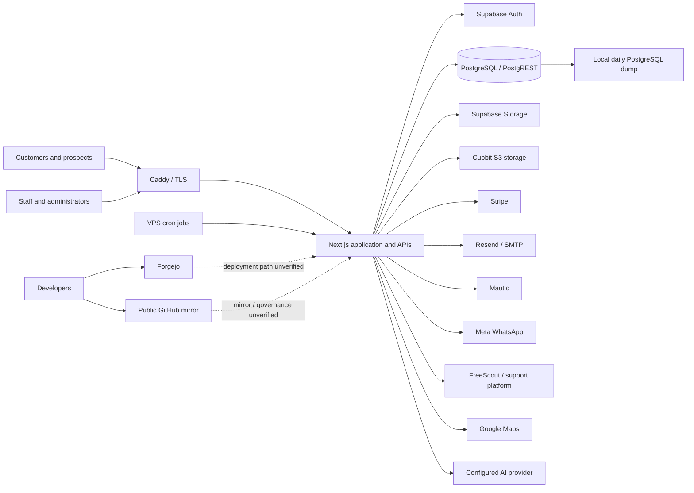

# Architecture inventory

Status: **DRAFT — REQUIRES VERIFICATION**
Observed: 2026-08-21

## Verified from repository or read-only metadata

| Component | Function | Evidence | Verification boundary |
| --- | --- | --- | --- |
| Next.js 15 application | Public site, portals, administration, API and background-job endpoints | `package.json`; 108 route files observed | Runtime deployment not inspected |
| Supabase/PostgreSQL | Auth, PostgREST, database, storage, realtime and supporting services | `supabase/config.toml`; 59 migrations; VPS override | Connected cloud project was inactive; deployed self-hosted state unverified |
| Caddy reverse proxy | TLS termination and security headers | `deploy/vps/Caddyfile.*` | Live config/TLS not inspected |
| Docker Compose/VPS | Standalone Next.js container and self-hosted Supabase services | `deploy/vps/app.compose.yml`; `supabase.override.yml` | Host OS, firewall and active containers unverified |
| Stripe | Checkout, payment method setup, invoices, refunds, subscriptions and signed webhooks | Stripe library/routes and `.env.example` keys | Account configuration, roles and webhook delivery unverified |
| Mautic | Marketing contacts, tags, scoring and campaigns | `src/lib/mautic/*`; `deploy/mautic/*` | Live tenant and retention unverified |
| Resend/SMTP | Transactional and Supabase authentication email | `src/lib/transactional-email.ts`; Supabase config | Account access, DKIM/DMARC and logs unverified |
| WhatsApp/Meta | Customer messaging, webhooks and conversation processing | `src/lib/whatsapp/*`; migrations | Meta account permissions and retention unverified |
| FreeScout/Hospitality Support | Ticket synchronization and attachments | support libraries, routes and documentation | Which support backend is production is unverified |
| Cubbit S3-compatible storage | Support/pause attachments and archive migration | AWS SDK dependency and `CUBBIT_*` configuration | Bucket policy, encryption, lifecycle and backup unverified |
| Cloudflare Turnstile | Bot protection on selected public forms | `src/lib/turnstile.ts` and form components | Production enablement unverified |
| Google services | Maps/address lookup and optional Analytics | maps/analytics code and configuration keys | Production enablement and account permissions unverified |
| AI providers | Optional assistant inference/embeddings through Gemini, Grok, Groq or configured API | assistant code and configuration keys | Active provider, data-processing terms and regional routing unverified |
| GitHub | Public source mirror and repository governance | Git remote and GitHub API metadata | `main` is unprotected; security features disabled |
| Forgejo | Git remote, likely development/deployment coordination | `forgejo` Git remote | Server, users, rules and backup unverified |

## Logical architecture

## Trust boundaries

1. Internet to Caddy/Next.js.
2. Browser session to Supabase Auth and Data API.
3. Next.js server to service-role/PostgREST and third-party APIs.
4. Public webhooks to privileged event processors.
5. VPS public network to self-hosted Supabase Kong; database pooler is configured to bind loopback.
6. Dar Tahara systems to external processors and storage providers.
7. Development repositories and credentials to production deployment.
8. Operational staff/devices to customer properties, access instructions and photographs.

## Unresolved architecture questions

- Which VPS, region, legal entity, and DNS provider serve production?
- Is Forgejo or GitHub authoritative for release and deployment?
- Is the self-hosted Supabase deployment the sole production datastore?
- Which AI, support, analytics and OAuth integrations are enabled in production?
- Where Mautic and FreeScout are hosted, backed up and monitored?
- Whether endpoint management, EDR, VPN, WAF/CDN, centralized logs or alerting exist outside the repository?
