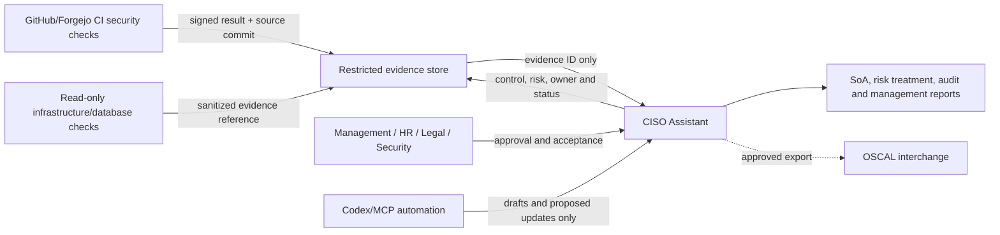

# Compliance/GRC tooling recommendation

Status: **RECOMMENDATION — APPROVAL REQUIRED BEFORE INSTALLATION**

## Recommendation

Adopt a self-hosted trial of **CISO Assistant Community** as the human-governed ISMS system of record, while keeping technical evidence automation in the repository and CI. Do not make an ISO 27001 MCP server the authoritative record in the first phase.

Why CISO Assistant is the best current fit:

- It supports risk, assets, controls, evidence, audits, suppliers, policies, incidents and reporting in one multi-user system.
- Its ISO-specific workflow generates a Statement of Applicability from the maintained audit and risk data rather than requiring duplicate entry.
- Self-hosting keeps sensitive control/evidence metadata under Dar Tahara's control, subject to the same backup, access and patching requirements as any other critical system.
- API/CLI/MCP and import/export capabilities leave room for automated evidence collection without allowing an agent to accept risks or approve controls.

## Why not use an ISO27001 MCP as the primary record yet

The reviewed community ISO27001 MCP project advertises all 93 controls, risks, evidence, SoA, encrypted local SQLite, audit chaining and human approval gates. It is promising for an analyst workspace or controlled pilot. It has a narrower trust and collaboration model than a mature multi-user GRC platform and needs a security review of authentication, key management, backups, audit-log tamper resistance, export/restore, release provenance and project sustainability before it holds authoritative ISMS records.

## OSCAL

Use OSCAL JSON/YAML later as an interchange/automation format for controls, evidence references, assessment results and remediation plans. OSCAL is a machine-readable standard, not a replacement for management governance or a complete user-facing ISMS workflow.

## Proposed architecture

## Pilot acceptance criteria

- SSO/MFA or strong local admin controls; least-privilege roles.
- Encrypted transport/storage and documented key custody.
- Automated encrypted backups plus a successful restore test.
- Immutable or independently protected audit trail.
- Reliable CSV/JSON export of assets, risks, SoA, evidence references and history.
- No raw customer/employee data or credentials stored as evidence.
- Approval gates prevent agents from accepting risk, approving policy or closing findings.
- Patch/upgrade owner, vulnerability SLA and exit plan.

## Decision requested

Approve a non-production CISO Assistant pilot with synthetic data and import of these registers. Do not install or import sensitive evidence until Security, Operations and Management approve the design.

References: [CISO Assistant ISO workflow](https://github.com/intuitem/ciso-assistant-community/blob/main/product-docs/features/framework-specific/iso.md), [CISO Assistant Community](https://github.com/intuitem/ciso-assistant-community), [community ISO27001 MCP](https://github.com/Sushegaad/MCP-Server-for-ISO27001), [NIST OSCAL](https://github.com/usnistgov/OSCAL).
